<picture><source media="(prefers-reduced-motion: reduce) and (max-width: 650px)" srcset="assets/ember-v2/hero.mobile.static.svg"><source media="(max-width: 650px)" srcset="assets/ember-v2/hero.mobile.svg"><source media="(prefers-reduced-motion: reduce)" srcset="assets/ember-v2/hero.static.svg"></picture>

<a href="https://www.linkedin.com/in/khaled-alrefai-668079273/">LinkedIn ↗</a> &nbsp;·&nbsp; <a href="https://github.com/Kaldx5?tab=repositories">Repositories ↗</a>

<picture><source media="(prefers-reduced-motion: reduce) and (max-width: 650px)" srcset="assets/ember-v2/trajectory.mobile.static.svg"><source media="(max-width: 650px)" srcset="assets/ember-v2/trajectory.mobile.svg"><source media="(prefers-reduced-motion: reduce)" srcset="assets/ember-v2/trajectory.static.svg"></picture>

<a href="https://github.com/Kaldx5/GSwitcher"><picture><source media="(prefers-reduced-motion: reduce) and (max-width: 650px)" srcset="assets/ember-v2/gswitcher-card.mobile.static.svg"><source media="(max-width: 650px)" srcset="assets/ember-v2/gswitcher-card.mobile.svg"><source media="(prefers-reduced-motion: reduce)" srcset="assets/ember-v2/gswitcher-card.static.svg"></picture></a>

<a href="https://github.com/Kaldx5/GSwitcher">Source and design decisions ↗</a>

<a href="https://github.com/Kaldx5/DDDS"><picture><source media="(prefers-reduced-motion: reduce) and (max-width: 650px)" srcset="assets/ember-v2/ddds-card.mobile.static.svg"><source media="(max-width: 650px)" srcset="assets/ember-v2/ddds-card.mobile.svg"><source media="(prefers-reduced-motion: reduce)" srcset="assets/ember-v2/ddds-card.static.svg"></picture></a>

<a href="https://github.com/Kaldx5/DDDS">Project source ↗</a> &nbsp;·&nbsp; <a href="https://github.com/Kaldx5/DDDS-Acceptance-Test-Report">Acceptance test report ↗</a>

<a href="https://github.com/Kaldx5/NIBRAS-Showcase"><picture><source media="(prefers-reduced-motion: reduce) and (max-width: 650px)" srcset="assets/ember-v2/nibras-card.mobile.static.svg"><source media="(max-width: 650px)" srcset="assets/ember-v2/nibras-card.mobile.svg"><source media="(prefers-reduced-motion: reduce)" srcset="assets/ember-v2/nibras-card.static.svg"></picture></a>

<a href="https://github.com/Kaldx5/NIBRAS-Showcase">Public showcase ↗</a> &nbsp;·&nbsp; <a href="https://kaldx5.github.io/NIBRAS-Showcase/">Visual gallery ↗</a>

<picture><source media="(prefers-reduced-motion: reduce) and (max-width: 650px)" srcset="assets/ember-v2/engineering-loop.mobile.static.svg"><source media="(max-width: 650px)" srcset="assets/ember-v2/engineering-loop.mobile.svg"><source media="(prefers-reduced-motion: reduce)" srcset="assets/ember-v2/engineering-loop.static.svg"></picture>

<picture><source media="(prefers-reduced-motion: reduce) and (max-width: 650px)" srcset="assets/ember-v2/interest-map.mobile.static.svg"><source media="(max-width: 650px)" srcset="assets/ember-v2/interest-map.mobile.svg"><source media="(prefers-reduced-motion: reduce)" srcset="assets/ember-v2/interest-map.static.svg"></picture>

<picture><source media="(prefers-reduced-motion: reduce) and (max-width: 650px)" srcset="assets/ember-v2/toolkit.mobile.static.svg"><source media="(max-width: 650px)" srcset="assets/ember-v2/toolkit.mobile.svg"><source media="(prefers-reduced-motion: reduce)" srcset="assets/ember-v2/toolkit.static.svg"></picture>

<picture><source media="(prefers-reduced-motion: reduce) and (max-width: 650px)" srcset="assets/ember-v2/activity.mobile.static.svg"><source media="(max-width: 650px)" srcset="assets/ember-v2/activity.mobile.svg"><source media="(prefers-reduced-motion: reduce)" srcset="assets/ember-v2/activity.static.svg"></picture>

<picture><source media="(prefers-reduced-motion: reduce) and (max-width: 650px)" srcset="assets/ember-v2/footer.mobile.static.svg"><source media="(max-width: 650px)" srcset="assets/ember-v2/footer.mobile.svg"><source media="(prefers-reduced-motion: reduce)" srcset="assets/ember-v2/footer.static.svg"></picture>
