<picture><source media="(prefers-reduced-motion: reduce) and (max-width: 650px)" srcset="assets/ember/hero.mobile.static.svg"><source media="(max-width: 650px)" srcset="assets/ember/hero.mobile.svg"><source media="(prefers-reduced-motion: reduce)" srcset="assets/ember/hero.static.svg"></picture>

I'm Khaled, a Computer Engineer who likes understanding what is happening beneath the surface. I start with a real problem, research it, test possible explanations, and refine the result when the evidence changes. My work connects computer vision, Windows systems, hardware behavior, and offline-first architecture.

[LinkedIn](https://www.linkedin.com/in/khaled-alrefai-668079273/) · [Engineering work](https://github.com/Kaldx5?tab=repositories)

## From perception to control to architecture

<picture><source media="(prefers-reduced-motion: reduce) and (max-width: 650px)" srcset="assets/ember/trajectory.mobile.static.svg"><source media="(max-width: 650px)" srcset="assets/ember/trajectory.mobile.svg"><source media="(prefers-reduced-motion: reduce)" srcset="assets/ember/trajectory.static.svg"></picture>

## GSwitcher · observable Windows systems

<a href="https://github.com/Kaldx5/GSwitcher"><picture><source media="(prefers-reduced-motion: reduce) and (max-width: 650px)" srcset="assets/ember/gswitcher-card.mobile.static.svg"><source media="(max-width: 650px)" srcset="assets/ember/gswitcher-card.mobile.svg"><source media="(prefers-reduced-motion: reduce)" srcset="assets/ember/gswitcher-card.static.svg"></picture></a>

**[GSwitcher](https://github.com/Kaldx5/GSwitcher)** From thermal troubleshooting to a local systems utility.

- Power & processor configuration
- Diagnostics, recovery & automation
- GPU-route observation and control-path R&D

Built from manual power and thermal investigation into PowerShell workflows and a C#/WPF utility. GPU-route R&D is distinct from reliable MUX switching. The images are interface previews with example states, not live hardware measurements.

## DDDS · local computer vision

<a href="https://github.com/Kaldx5/DDDS"><picture><source media="(prefers-reduced-motion: reduce) and (max-width: 650px)" srcset="assets/ember/ddds-card.mobile.static.svg"><source media="(max-width: 650px)" srcset="assets/ember/ddds-card.mobile.svg"><source media="(prefers-reduced-motion: reduce)" srcset="assets/ember/ddds-card.static.svg"></picture></a>

**[DDDS](https://github.com/Kaldx5/DDDS)** Perception under real-time and hardware constraints.

- Computer vision & TinyML exploration
- Graduation project / final grade AA
- 11 of 14 acceptance checks passed

11/14 is acceptance-check coverage, not model accuracy. [Acceptance report](https://github.com/Kaldx5/DDDS-Acceptance-Test-Report).

## NIBRAS · offline-first market information

<a href="https://github.com/Kaldx5/NIBRAS-Showcase"><picture><source media="(prefers-reduced-motion: reduce) and (max-width: 650px)" srcset="assets/ember/nibras-card.mobile.static.svg"><source media="(max-width: 650px)" srcset="assets/ember/nibras-card.mobile.svg"><source media="(prefers-reduced-motion: reduce)" srcset="assets/ember/nibras-card.static.svg"></picture></a>

**[NIBRAS](https://github.com/Kaldx5/NIBRAS-Showcase)** Useful information when connectivity is unreliable.

- Offline-first system design
- Arabic experience, maps & data trust
- Private project / public showcase

A public showcase of a wider project in development. The map and dashboard are development captures; visible prices and counts are demonstration values.

## How I approach problems

<picture><source media="(prefers-reduced-motion: reduce) and (max-width: 650px)" srcset="assets/ember/engineering-loop.mobile.static.svg"><source media="(max-width: 650px)" srcset="assets/ember/engineering-loop.mobile.svg"><source media="(prefers-reduced-motion: reduce)" srcset="assets/ember/engineering-loop.static.svg"></picture>

## Connected interests

<picture><source media="(prefers-reduced-motion: reduce) and (max-width: 650px)" srcset="assets/ember/interest-map.mobile.static.svg"><source media="(max-width: 650px)" srcset="assets/ember/interest-map.mobile.svg"><source media="(prefers-reduced-motion: reduce)" srcset="assets/ember/interest-map.static.svg"></picture>

Agentic systems and quantum computing are exploratory interests, not research credentials or completed products.

## Tools used in these projects

<picture><source media="(prefers-reduced-motion: reduce) and (max-width: 650px)" srcset="assets/ember/toolkit.mobile.static.svg"><source media="(max-width: 650px)" srcset="assets/ember/toolkit.mobile.svg"><source media="(prefers-reduced-motion: reduce)" srcset="assets/ember/toolkit.static.svg"></picture>

These are project technologies and interfaces, not equal proficiency claims in every item.

## Public GitHub snapshot

<picture><source media="(prefers-reduced-motion: reduce) and (max-width: 650px)" srcset="assets/ember/activity.mobile.static.svg"><source media="(max-width: 650px)" srcset="assets/ember/activity.mobile.svg"><source media="(prefers-reduced-motion: reduce)" srcset="assets/ember/activity.static.svg"></picture>

Captured 2026-09-27T22:48:37.773131+00:00. Counts describe public work and GitHub-visible contributions, not professional experience.

<picture><source media="(prefers-reduced-motion: reduce) and (max-width: 650px)" srcset="assets/ember/footer.mobile.static.svg"><source media="(max-width: 650px)" srcset="assets/ember/footer.mobile.svg"><source media="(prefers-reduced-motion: reduce)" srcset="assets/ember/footer.static.svg"></picture>
