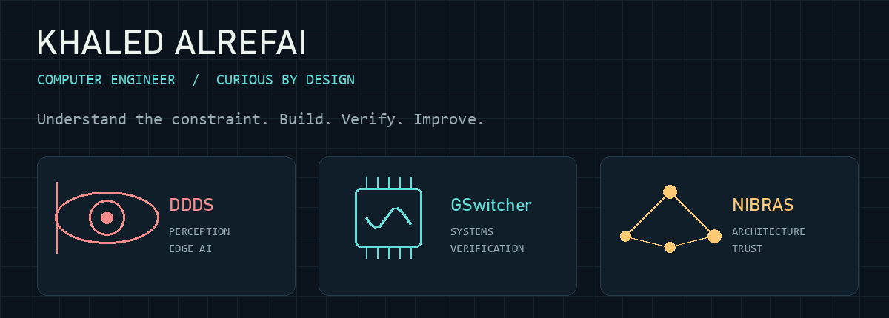
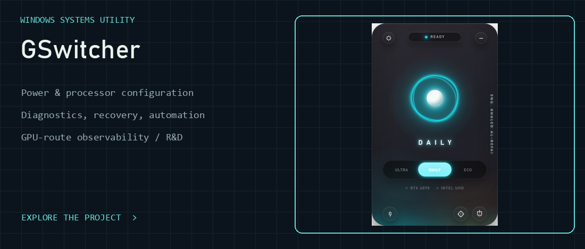
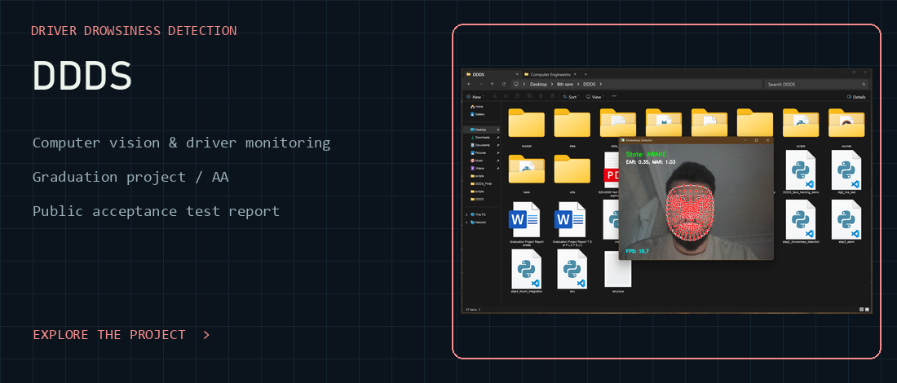
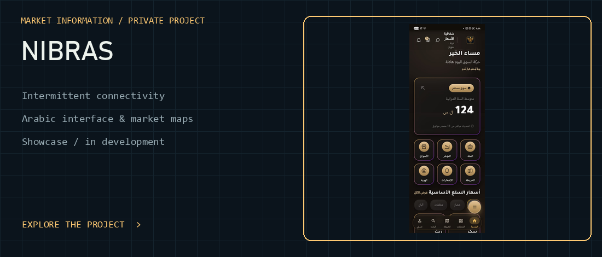
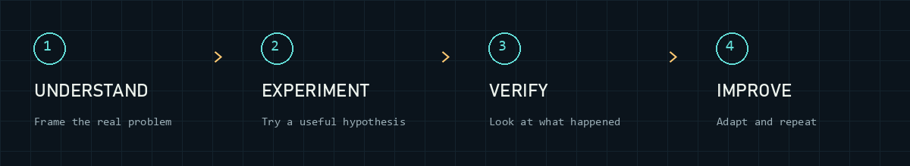
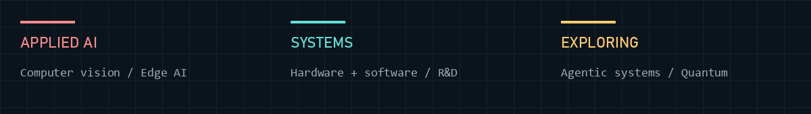

<picture>
  <source media="(prefers-reduced-motion: reduce)" srcset="assets/engineering-lab.png">
  
</picture>

  <a href="https://www.linkedin.com/in/khaled-alrefai-668079273/">LinkedIn ↗</a> &nbsp; · &nbsp;
  <a href="https://github.com/Kaldx5?tab=repositories">Projects ↗</a> &nbsp; · &nbsp;
  <a href="https://kaldx5.github.io/NIBRAS-Showcase/">NIBRAS visual gallery ↗</a>

## Hi, I'm Khaled 👋

I'm a Computer Engineering graduate who likes getting to the bottom of things. Most of my projects start with a problem I want to understand. I read, experiment, question what I'm seeing, and keep going until I can build something useful with it.

That has taken me from computer vision and TinyML to Windows power management, hardware behavior, market intelligence, and product design. I enjoy moving between these fields and finding connections I can actually use. 🧠

## Three projects, different constraints 🛠️

**From a hot laptop to a systems project.** Manual power tuning became PowerShell scripts, then a menu, and eventually a desktop application. Local controls, diagnostics and recovery, with GPU-route observation and investigation kept distinct from reliable switching.

[Explore source](https://github.com/Kaldx5/GSwitcher/tree/main/source/GSwitcher.Desktop) · [Read the engineering decisions](https://github.com/Kaldx5/GSwitcher)

**Perception under real-time constraints.** My graduation project combines computer vision, driver monitoring and TinyML exploration. Developed and presented at Istanbul Okan University, with a final grade of **AA**.

[Explore DDDS](https://github.com/Kaldx5/DDDS) · [Public acceptance test report](https://github.com/Kaldx5/DDDS-Acceptance-Test-Report)

**Useful information when connectivity is unreliable.** Local market information, trust in the data, maps and an Arabic interface. The public showcase is a small glimpse into the wider project, which remains private and in development. 🌍

[Real-device gallery](https://kaldx5.github.io/NIBRAS-Showcase/) · [Selected design studies](https://kaldx5.github.io/NIBRAS-Showcase/design/) · [Project guide](https://github.com/Kaldx5/NIBRAS-Showcase/blob/main/docs/NIBRAS-Public-Showcase.pdf)

More of NIBRAS, in pictures

Selected design studies alongside the real-device captures. The design studies contain demonstration data.

[Explore all eight studies](https://kaldx5.github.io/NIBRAS-Showcase/design/)

## How I work 🔍

I like work that gives me something worth digging into and a chance to turn that understanding into a useful result.

A little more about my process

I take an active role in the research, planning, design, implementation, and review of my projects. I'm comfortable using AI and coding tools, and bring them in when they help me explore an idea, speed up a task, or work through a difficult part. The decisions still need to make sense to me.

## What draws my curiosity ⚙️

**Applied AI · Computer Vision · TinyML / Edge AI · Systems R&D · Hardware/software integration**

Also exploring **agentic systems** and **quantum computing**. These are interests I'm developing, alongside the work shown above.

Tools used across these projects

| Project | Selected technologies and interfaces |
| :--- | :--- |
| DDDS | Python, OpenCV, MediaPipe; TensorFlow Lite / edge-AI exploration |
| GSwitcher | C#, WPF, PowerShell, WebView2, Windows APIs, WMI |
| NIBRAS | Flutter / Dart, Python / FastAPI, SQLite; offline-first system design |

These describe the projects' technology stacks, rather than a proficiency score for every tool.

